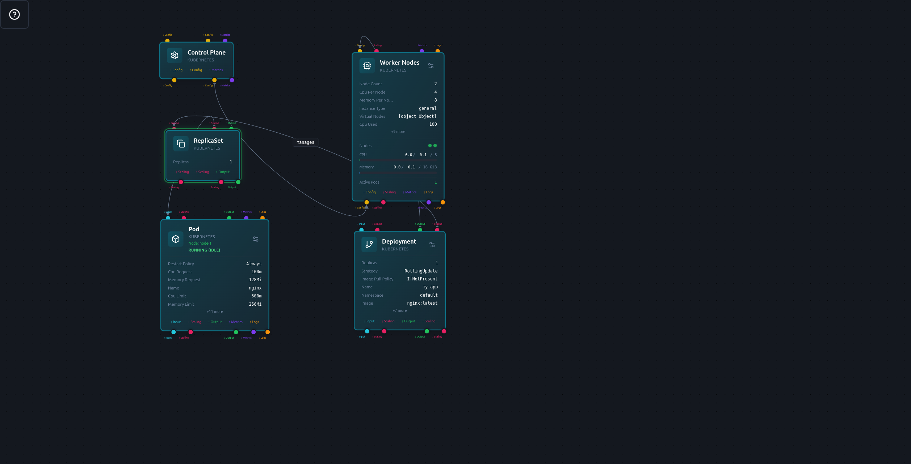

# Lab caseiro

## Descrição:

Utilizando pc's disponíveis em casa, vamos montar um sistema de clusters Kubernetes para emular os serviços que utilizo em cloud.\
Os serviços que precisam ser alocados são:
- Bind9 - Sistema de DNS para distribuição de serviços de NIC, domínios de teste:
    - testes.carlosclaro.com.br
    - portais.carlosclaro.com.br
    - app.carlosclaro.com.br
    - carlosclaro.ddns.net
    - pow.ddns.net
    - mysql.carlosclaro.com.br
    Limits
        - CPU - 0.3
        - Memory - 128Mi
- Apache / Lets encrypt
    - PHP 7.4 - Sistema de administração de imóveis e Sites, framework Codeigniter, comunica com MySQL e Mongodb. DNS - testes.carlosclaro.com.br
    - PHP 7.4 - Sistema de Portais com multiplos domínios, framework Codeigniter, comunica com Mongodb. DNS - portais.carlosclaro.com.br
    - php 8.2 - Sistema novo de administração, framework Laravel, comunica com MySQL e Mongodb. DNS - app.carlosclaro.com.br
    - Limits
        - CPU - 4
        - Memory - 8Gi
- MongoDb - aberto apenas para o cluster
    - Limits
        - CPU - 1
        - Memory - 4Gi
- MySQL
    - Limits
        - CPU - 1
        - Memory - 2Gi

## Simulação 

Utilizando o [Strigus.io](Strigus.io), simularemos o que precisamos implementar.

