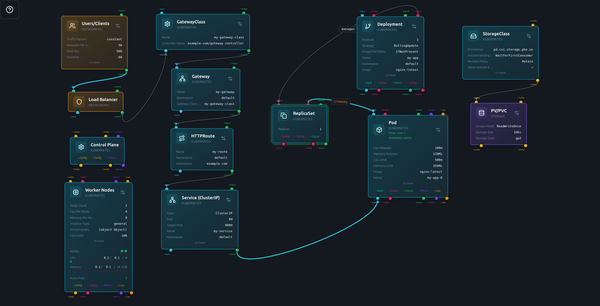

# Lab caseiro do Saltinho da Malhada

## Referências:
- [https://github.com/kelseyhightower/kubernetes-the-hard-way/tree/master](https://github.com/kelseyhightower/kubernetes-the-hard-way/tree/master)
- [RaspFirstSteps](./RaspFirstStep.md) - configurações iniciais para raspberry architecture arm64

## Objetivo:
Criar um Laboratório de estudos de kubernetes com cluster, utilizando hardware disponível que é fruto de acumulo de anos e obsolescência.

Exibiremos a composição de cada hardware, primeiros passos, configurações iniciais com o resultado um Cluster com 5 máquinas, 1 control plane e 4 workers, prontos para receber aplicações leves e disponíveis na rede.

O título, "Lab caseiro do Saltinho da Malhada" foi inspirado na localização geografica que trabalhamos, uma área rural da região de Curitiba-PR

A intenção do artigo é exibir os primeiros passos e desafios de implementar cluster kubernetes físico, com base nas aulas do curso [Descomplicando Kubernetes da linuxTips](https://linuxtips.io/treinamento/descomplicando-o-kubernetes)

## Instalação e Configuração inicial Kubernetes

Para este projeto vamos utilizar [kubeadm](https://kubernetes.io/pt-br/docs/reference/setup-tools/kubeadm). É uma ferramenta para criar e gerenciar um cluster Kubernetes em vários nós. Ele automatiza muitas das tarefas de configuração do cluster, incluindo a instalação do control plane e dos nodes. É altamente configurável e pode ser usado para criar clusters personalizados.

Se for a primeira configuração de um raspios, utilize o arquivo [./RaspFirstStep.md] e deixe o equipamento pronto para a instalação

Ainda na preparação, vamos desativar o swap da memória, pois o suporte para swap ainda está em desenvolvimento e não desativer pode causar problemas na montagem:
- adm64: `sudo swapoff -a`
- arm64: `sudo service rpi-setup-loop@var-swap stop`

## Carregando módulos
```
cat <<EOF | sudo tee /etc/modules-load.d/k8s.conf
overlay
br_netfilter
EOF

sudo modprobe overlay
sudo modprobe br_netfilter
```
O comando modprobe overlay carrega o módulo de kernel overlayfs no Linux, fundamental para o funcionamento do driver de armazenamento overlay2 no Docker e contêineres, permitindo a união de diretórios.

O comando modprobe br_netfilter carrega o módulo de kernel necessário para permitir que tráfego de rede em ponte (bridge) seja processado pelas regras do iptables. É essencial para orquestradores de contêineres, como Kubernetes e Docker, garantindo que o tráfego entre contêineres e redes virtuais seja corretamente filtrado e roteado Unix & Linux Stack Exchange. 

## Configurando parâmetros do sistema
```
cat <<EOF | sudo tee /etc/sysctl.d/k8s.conf
net.bridge.bridge-nf-call-iptables  = 1
net.bridge.bridge-nf-call-ip6tables = 1
net.ipv4.ip_forward                 = 1
EOF

sudo sysctl --system
```
Isso garantirá que nosso cluster funcione corretamente.

## Instalando pacotes kubernetes
### amd64
Essenciais: `sudo apt-get update && sudo apt-get install -y apt-transport-https ca-certificates curl gnupg lsb-release systemd-resolved wget curl vim openssl git`

Copiar keys: `curl -fsSL https://download.docker.com/linux/ubuntu/gpg | sudo gpg --dearmor -o /usr/share/keyrings/docker-archive-keyring.gpg`

Source: `echo "deb [arch=amd64 signed-by=/usr/share/keyrings/docker-archive-keyring.gpg] https://download.docker.com/linux/ubuntu $(lsb_release -cs) stable" | sudo tee /etc/apt/sources.list.d/docker.list > /dev/null`
Lembrando de mudar o SO de Ubuntu para Debian quando for o caso.

### arm64
Essenciais: `sudo apt update && sudo apt upgrade -y && sudo apt install -y apt-transport-https ca-certificates curl gnupg2 software-properties-common systemd-resolved libc6 libseccomp2 wget curl vim openssl git`

Copiar keys: `curl -fsSL https://download.docker.com/linux/debian/gpg | sudo gpg --dearmor -o /etc/apt/keyrings/docker.gpg`

`curl -fsSL https://pkgs.k8s.io/core:/stable:/v1.31/deb/Release.key | sudo gpg --dearmor -o /etc/apt/keyrings/kubernetes-apt-keyring.gpg `

Source: `echo "deb [arch=$(dpkg --print-architecture) signed-by=/etc/apt/keyrings/docker.gpg] https://download.docker.com/linux/debian $(lsb_release -cs) stable" | sudo tee /etc/apt/sources.list.d/docker.list > /dev/null`

`echo "deb [signed-by=/etc/apt/keyrings/kubernetes-apt-keyring.gpg] https://pkgs.k8s.io/core:/stable:/v1.34/deb/ /" | sudo tee /etc/apt/sources.list.d/kubernetes.list > /dev/null`
---
## todos

Instalando: `sudo apt-get update && sudo apt-get install -y containerd.io`

`sudo apt install -y docker-ce docker-ce-cli containerd.io`

## configurando containerd
```
sudo containerd config default | sudo tee /etc/containerd/config.toml

sudo sed -i 's/SystemdCgroup = false/SystemdCgroup = true/g' /etc/containerd/config.toml

sudo systemctl restart containerd
sudo systemctl status containerd
```

Ativar o kubelet `sudo systemctl enable --now kubelet`

## Composição hardware
- Raspberry PI 3B+ Black
```
$ hostnamectl
Static hostname: raspberrypi
       Icon name: computer
      Machine ID: 01b74a1cf2014dd6b7f9f4479cd52ff3
         Boot ID: 4f6ed1fe0778496993c951cb809232eb
Operating System: Debian GNU/Linux 13 (trixie)    
          Kernel: Linux 6.12.47+rpt-rpi-v8
    Architecture: arm64
```
- Raspberry PI 3B+ Red
```
$ hostnamectl
Static hostname: raspberrypired
       Icon name: computer
      Machine ID: 09d491f7391a4b03932d23b3ea0555a7
         Boot ID: dc3286b7ead845b49edc9c69ace20307
Operating System: Debian GNU/Linux 13 (trixie)    
          Kernel: Linux 6.12.47+rpt-rpi-v8
    Architecture: arm64
```
- Notebook dell i5 3 geração
```
$ sudo hostnamectl 
 Static hostname: CarlosDebian
       Icon name: computer-laptop
         Chassis: laptop 💻
      Machine ID: e1ba18f84650475ea1708b0796d8f568
         Boot ID: 66d19eb434dc49bebc1379a6ecfe5493
    Product UUID: 4c4c4544-0056-3010-8043-cac04f385331
Operating System: Debian GNU/Linux 13 (trixie)        
          Kernel: Linux 6.12.63+deb13-amd64
    Architecture: x86-64
 Hardware Vendor: Dell Inc.
  Hardware Model: Dell System XPS L502X
 Hardware Serial: JV0C8S1
Firmware Version: A12
   Firmware Date: Fri 2012-09-07
    Firmware Age: 13y 4month 2w 2d  
```
- Desktop  i5 3 geração
```
$ sudo hostnamectl 
 Static hostname: pow.ddns.net
       Icon name: computer-desktop
         Chassis: desktop
      Machine ID: 252652c84dff4637a8e9b88d66ac29f7
         Boot ID: 93107e2b1fba45bca5c91fd88f067ee5
Operating System: Ubuntu 22.04.5 LTS              
          Kernel: Linux 5.15.0-164-generic
    Architecture: x86-64
 Hardware Vendor: QBEX
  Hardware Model: QBEX-H61H2-M17

```
- Desktop I5 10 geração
```
$ sudo hostnamectl 
 Static hostname: carlos-ubuntu
       Icon name: computer-desktop
         Chassis: desktop 🖥️
      Machine ID: 3f1784869f614e09a97776aca87a9fda
         Boot ID: afc09adaaaa24f8e9adfeb1e17f089ed
    Product UUID: 03000200-0400-0500-0006-000700080009
Operating System: Ubuntu 25.10                        
          Kernel: Linux 6.17.0-8-generic
    Architecture: x86-64
 Hardware Vendor: Gigabyte Technology Co., Ltd.
  Hardware Model: H410M H
 Hardware Serial: Default string
Firmware Version: F2
   Firmware Date: Wed 2020-05-27
    Firmware Age: 5y 7month 4w 
```


## Serviços:

Utilizando pc's disponíveis em casa, vamos montar um sistema de clusters Kubernetes para emular os serviços que utilizo em cloud.\
Os serviços que precisam ser alocados são:
- Bind9 - Sistema de DNS para distribuição de serviços de NIC, domínios de teste:
    - testes.carlosclaro.com.br
    - portais.carlosclaro.com.br
    - app.carlosclaro.com.br
    - api.carlosclaro.com.br
    - local.carlosclaro.com.br
    - carlosclaro.ddns.net
    - pow.ddns.net
    - mysql.carlosclaro.com.br
    Limits
        - CPU - 0.3
        - Memory - 128Mi
- Apache / Lets encrypt
    - PHP 7.4 - Sistema de administração de imóveis e Sites, framework Codeigniter, comunica com MySQL e Mongodb. DNS - testes.carlosclaro.com.br
    - PHP 7.4 - Sistema de Portais com multiplos domínios, framework Codeigniter, comunica com Mongodb. DNS - portais.carlosclaro.com.br
    - php 8.2 - Sistema novo de administração, framework Laravel, comunica com MySQL e Mongodb. DNS - app.carlosclaro.com.br
    - Limits
        - CPU - 4
        - Memory - 8Gi
- MongoDb - aberto apenas para o cluster
    - Limits
        - CPU - 1
        - Memory - 4Gi
- MySQL
    - Limits
        - CPU - 1
        - Memory - 2Gi

## Simulação 

Utilizando o [Strigus.io](Strigus.io), simularemos o que precisamos implementar.




## Implementa weave daemonset - day 5
Colabora com a comunicação entre as instâncias do cluster
`kubectl apply -f day-5/weave-daemonset-k8s.yaml`\
verifica com `kubectl get pods -A -o wide`

## Implementando LoadBalancer com MetalLB - day-9
[https://metallb.io/installation](https://metallb.io/installation)

preconfig:
```
$ kubectl edit configmap -n kube-system kube-proxy
--- edit set
apiVersion: kubeproxy.config.k8s.io/v1alpha1
kind: KubeProxyConfiguration
mode: "ipvs"
ipvs:
  strictARP: true
```
aplica `kubectl aplly -f ../day-9/metallb-native.yaml`\
Verifica se instalou com `kubectl get all -n metallb-system`\
aplica `kubectl apply -f ../day-9/ipaddress-pool.yaml`\
verifica com `kubectl get ipaddress` 

## Aplicando nginx-ingress-controller - day-9
A aplicação de nginx ingress controller está sendo descontinuada, então verificar [https://docs.nginx.com/nginx-gateway-fabric/overview/gateway-architecture](https://docs.nginx.com/nginx-gateway-fabric/overview/gateway-architecture)

aplica ingress controller `kubectl apply -f ../day-9/nginx-controller-deploy.yaml`\
verifica com `kubectl get all -n ingress-nginx`\
Depois que o `kubectl get pods --namespace=ingress-nginx` estiver rodando:
```
kubectl wait --namespace ingress-nginx \
  --for=condition=ready pod \
  --selector=app.kubernetes.io/component=controller \
  --timeout=120s
```
Neste passo, já vai conseguir acessar o nginx ingres com erro 404, pois ainda não tem nenhum pod aplicado para o servidor.
endereço ip da aplicação, neste caso: 192.168.0.106 na rede local

## Preparação do servidor para receber certificados com cert-manager - day-10
Instalando com `kubectl apply -f https://github.com/cert-manager/cert-manager/releases/download/v1.19.2/cert-manager.yaml`

verificando `kubectl get pods -n cert-manager`

utilizar os arquivos [./staging-issuer.yaml] `kubectl apply -f ../day-10/staging-issuer.yaml` (staging-issuer.yaml) e `kubectl apply -f ../day-10/production-issuer.yaml` [./production-issuer.yaml](production-issuer.yaml)\
verifica com `kubectl get issuers.cert-manager.io  ` e `kubectl get clusterissuers.cert-manager.io ` ou com `kubectl get secrets -A`


## Configurando Prometheus - day 11

Sistema de monitoramento e visualização dos processos.\
Aplica com `kubectl create -f ../prometheus/kube-prometheus/manifests/setup/` para preparar o ambiente. e depois aplica `kubectl apply -f ../prometheus/kube-prometheus/manifests/`

verifica com `kubectl get all -n monitoring` 


